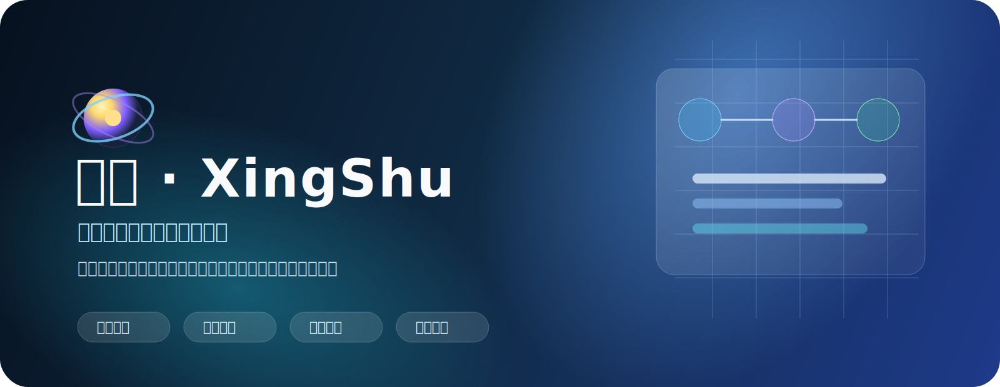
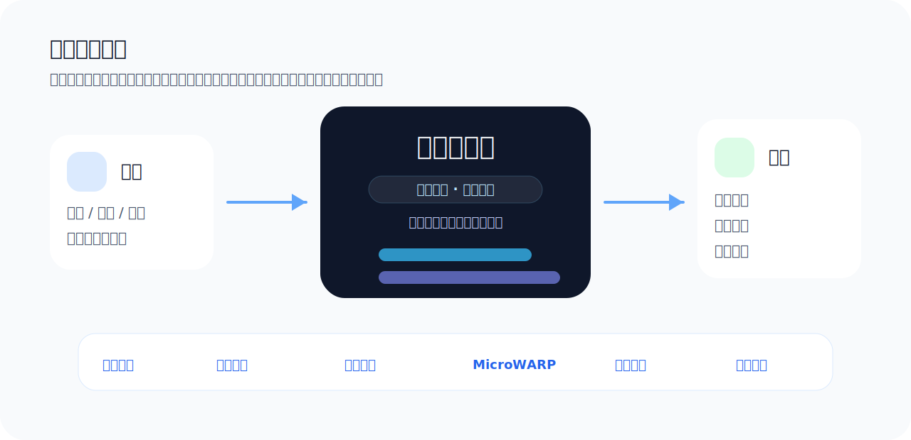
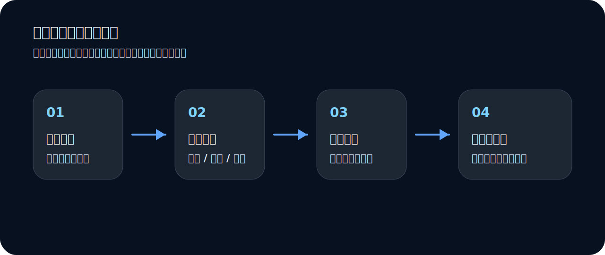

<p align="center">
  
</p>

<p align="center">
  <a href="https://github.com/nnwc/xingshu/actions/workflows/docker-publish.yml"></a>
  
  
  
  
</p>

<h1 align="center">星枢 · XingShu</h1>

<p align="center">
  <strong>智能调度你的自动化工作流</strong>
</p>

<p align="center">
  连接任务、脚本、通知与服务，构建统一的自动化执行中枢。
</p>

<p align="center">
  自动化调度 · 脚本管理 · 环境变量 · 实时日志 · 通知推送 · 订阅同步
</p>

---

## 星枢是什么？

**星枢（XingShu）** 是一套面向自托管场景的中文自动化调度系统。它把服务器上分散的脚本、定时任务、环境变量、执行日志、通知推送和备份恢复集中到一个可视化控制台里，让你的自动化流程更清晰、更稳定，也更容易长期维护。

它适合部署在个人服务器、VPS、家庭实验室或轻量运维环境中，用来替代散落的 `crontab`、手写脚本目录、临时环境变量和难以追踪的日志文件。

<p align="center">
  
</p>

---

## 适合谁使用？

如果你有下面这些需求，星枢会很合适：

- 想用中文界面管理服务器上的定时任务和脚本。
- 有多个自动化脚本，希望集中编辑、运行、查看日志。
- 需要管理环境变量、账号变量、运行参数和任务分组。
- 需要任务完成后自动推送通知，失败时及时知道。
- 需要多账号顺序执行、并发执行、轮询执行等场景。
- 想保留执行历史，方便回看每次任务结果。
- 不想上完整 PaaS，只需要一个轻量、清晰、好维护的自动化控制台。

---

## 核心能力

### 任务调度

- 支持 **定时任务**、**手动任务**、**开机任务**。
- 支持启用/禁用、分组、超时控制、并发策略。
- 支持前置命令、主命令、后置命令，适合复杂执行流程。
- 支持多账号运行模式：`single`、`sequential`、`concurrent`。

### 脚本管理

- 在线浏览、新建、编辑、上传脚本。
- 支持直接运行和调试运行。
- 区分源脚本和输出目录，避免产物污染脚本目录。
- 适合集中维护 Shell、Python、Node.js 等自动化脚本。

### 环境变量

- 可视化管理任务所需变量。
- 支持启用/禁用、标签、备注和创建时间。
- 多个任务可共享同一组环境变量，减少重复配置。

### 实时日志与历史追踪

- 任务运行时实时查看输出。
- 支持任务执行日志、系统日志、登录日志。
- 支持按天数、全局总数、每任务数量等策略清理日志。
- 任务完成后可继续回看历史结果。

### 通知推送

- 任务完成后自动推送结果。
- 支持完整日志或摘要通知。
- 适合失败提醒、定时报告、自动化结果回传。

### 订阅同步

- 支持远程仓库订阅和脚本同步。
- 可自动扫描并导入 Loader 脚本。
- 适合把常用脚本集中维护在 GitHub / GitLab / 私有仓库中。

### MicroWARP 集成

- 支持系统级 MicroWARP 配置。
- 任务运行前可触发出口切换。
- 适合多账号、轮询、出口 IP 管理等自动化场景。

---

## 典型使用流程

<p align="center">
  
</p>

1. **准备脚本**：在脚本管理中上传或新建脚本。
2. **配置变量**：在环境变量页维护账号、密钥、路径等运行参数。
3. **创建任务**：选择手动、定时或开机任务，填写命令和调度规则。
4. **运行观察**：启动任务后，在日志弹窗中查看实时输出。
5. **接收通知**：任务结束后，通过配置的通知渠道接收结果。
6. **长期维护**：通过日志策略、订阅同步、备份恢复持续管理。

---

## 快速开始

### 方式一：Docker 运行（推荐）

```bash
docker run -d \
  --name xingshu \
  --restart unless-stopped \
  -p 3000:3000 \
  -v $(pwd)/data:/app/data \
  -e DATABASE_URL=sqlite:///app/data/db/xingshu.db \
  -e RUST_LOG=info \
  -e TZ=Asia/Shanghai \
  ghcr.io/nnwc/xingshu:latest
```

然后访问：

```text
http://你的服务器IP:3000
```

首次部署建议把 `data` 目录持久化保存，数据库、脚本、日志和配置都会放在这里。

### 方式二：Docker Compose

创建 `docker-compose.yml`：

```yaml
services:
  xingshu:
    image: ghcr.io/nnwc/xingshu:latest
    container_name: xingshu
    ports:
      - "3000:3000"
    volumes:
      - ./data:/app/data
      - /var/run/docker.sock:/var/run/docker.sock
      - /usr/bin/docker:/usr/bin/docker:ro
    environment:
      - DATABASE_URL=sqlite:///app/data/db/xingshu.db
      - RUST_LOG=info
      - TZ=Asia/Shanghai
    restart: unless-stopped
```

启动：

```bash
docker compose up -d
```

查看状态：

```bash
docker ps
```

---

## 使用说明

### 1. 登录控制台

部署完成后打开 `http://服务器IP:3000`。首次使用请先完成初始化或登录，然后进入星枢管理后台。

### 2. 创建一个脚本

进入 **脚本管理**：

- 新建脚本，例如 `hello.sh`。
- 写入脚本内容。
- 保存后可直接测试运行。

示例：

```bash
#!/usr/bin/env bash
set -e
echo "Hello XingShu"
date
```

### 3. 配置环境变量

进入 **环境变量**：

- 新增变量，例如 `API_BASE_URL`、`TOKEN`、`ACCOUNT_LIST`。
- 给变量添加备注和标签。
- 根据需要启用或禁用。

任务运行时会自动读取已启用的全局环境变量。

### 4. 创建任务

进入 **任务管理**，选择新建任务：

- 任务类型：手动任务 / 定时任务 / 开机任务。
- 执行命令：例如 `bash hello.sh`。
- 工作目录：选择脚本所在目录。
- 通知策略：按需开启成功/失败通知。
- 多账号模式：需要批量跑账号时再开启。

保存后即可手动运行，或等待定时触发。

### 5. 查看日志

任务启动后可以直接打开日志弹窗：

- 运行中任务支持实时日志。
- 已完成任务可查看历史日志。
- 日志可配合保留策略自动清理。

### 6. 配置通知

进入 **系统配置 / 通知配置**：

- 填写推送渠道。
- 选择通知模板。
- 决定发送完整日志还是摘要。

建议至少开启失败通知，方便第一时间发现异常。

---

## 数据目录说明

建议持久化 `/app/data`，常见内容包括：

```text
data/
  db/          # SQLite 数据库
  scripts/     # 脚本目录
  logs/        # 执行日志
  backups/     # 备份文件
  jwt_secret   # 登录密钥等运行状态
```

长期使用时建议：

- 定期备份 `data` 目录。
- 不要把敏感配置提交到公开仓库。
- 更新镜像前先备份数据库和脚本。

---

## 本地开发

### 后端

```bash
cargo run
```

### 前端

```bash
cd web
npm install
npm run dev
```

### 构建 Docker 镜像

```bash
docker build -t xingshu:local .
```

---

## 技术栈

- **后端**：Rust、Axum、SQLx、SQLite、Tokio、tokio-cron-scheduler
- **前端**：React、TypeScript、Vite、Arco Design
- **部署**：Docker、Docker Compose、GitHub Actions

---

## 项目定位

星枢不是完整的云平台，也不是复杂的 CI/CD 系统。它更像一个轻量、清晰、中文友好的自动化执行中枢：

- 比 `crontab` 更直观。
- 比临时脚本目录更可维护。
- 比大型平台更轻量。
- 更适合个人服务器和自托管场景。

---

## License

MIT
